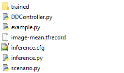

# DeepDriving
A basic DeepDriving implementation for BeamNG.

# Installation
This project uses many dependencies from [Netzebands](https://bitbucket.org/Netzeband/deepdriving/src/master/) DeepDriving implementation.
In order to ensure the proper functionality of this implementation these steps have to be followed first: 
- [Compile the C-Libraries](https://bitbucket.org/Netzeband/deepdriving/wiki/InstallWindowsCompile)
- [Setup your Python 3 Environment](https://bitbucket.org/Netzeband/deepdriving/wiki/InstallWindowsPython)

Download this repository and the trained model [here](https://www.dropbox.com/s/klwcj6bizpuw21m/trained.zip?dl=0) and extract it inside the repository.


This project was tested on Python 3.5.4

# Usage
Use DDController.py in order to generate driving controls:

```python
from DDController import Controller

controller = Controller(MAX_SPEED)
controls = controller.getControl(imageData, speed)
```

See the example for further instructions.

# Example
To run the example: 
```bash
python scenario.py
```
Wait for the BeamNG Scenario to start up and pause, then:
```bash
python example.py
```
The simulation should now start and the car should follow the road.
